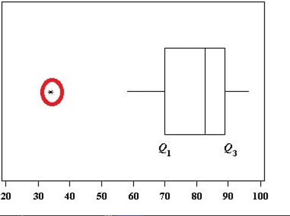
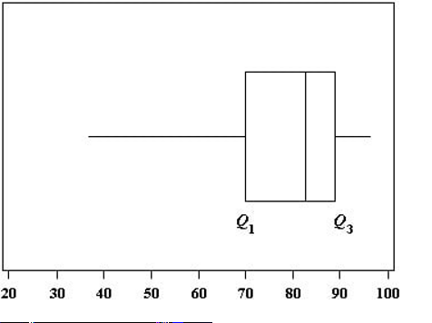

### What is an outlier?
 
An outlier is a piece of data that is an abnormal distance from other points. In other words, it’s data that lies outside the other values in the set. If you had Pinocchio in a class of children, the length of his nose compared to the other children would be an outlier.
In this set of random numbers, 1 and 201 are outliers:
1, 99, 100, 101, 103, 109, 110, 201
“1” is an extremely low value and “201” is an extremely high value.
Outliers aren’t always that obvious. Let’s say you received the following paychecks last month:
$225, $250, $25, $235.
Your average paycheck is $135. But that small paycheck ($25) might be because you went on vacation, so a weekly paycheck average of $135 isn’t a true reflection of how much you earned. Your average is actually closer to $237 if you take the outlier ($25) out of the set.
Of course, trying to find outliers isn’t always that simple. Your data set may look like this:
61, 10, 32, 19, 22, 29, 36, 14, 49, 3.
You could take a guess that 3 might be an outlier and perhaps 61. But you’d be wrong: 61 is the only outlier in this data set.
A box and whiskers chart (boxplot) often shows outliers:

The outlier on this boxplot is outside of the box and whiskers.
However, you may not have access to a box and whiskers chart. And even if you do, some boxplots may not show outliers. For example, this chart has whiskers that reach out to include outliers:

Therefore, don’t rely on finding outliers from a box and whiskers chart. That said, box and whiskers charts can be a useful tool to display them after you have calculated what your outliers actually are. The most effective way to find all of your outliers is by using the interquartile range (IQR). The IQR contains the middle bulk of your data, so outliers can be easily found once you know the IQR.
Back to Top
 
### How to Find Outliers Using the Interquartile Range(IQR)
Need help with a homework question? Check out our tutoring page!
An outlier is defined as being any point of data that lies over 1.5 IQRs below the first quartile (Q1) or above the third quartile (Q3)in a data set.
High = (Q3) + 1.5 IQR
Low = (Q1) – 1.5 IQR

From <https://www.statisticshowto.com/statistics-basics/find-outliers/#HowtoFindO> 

